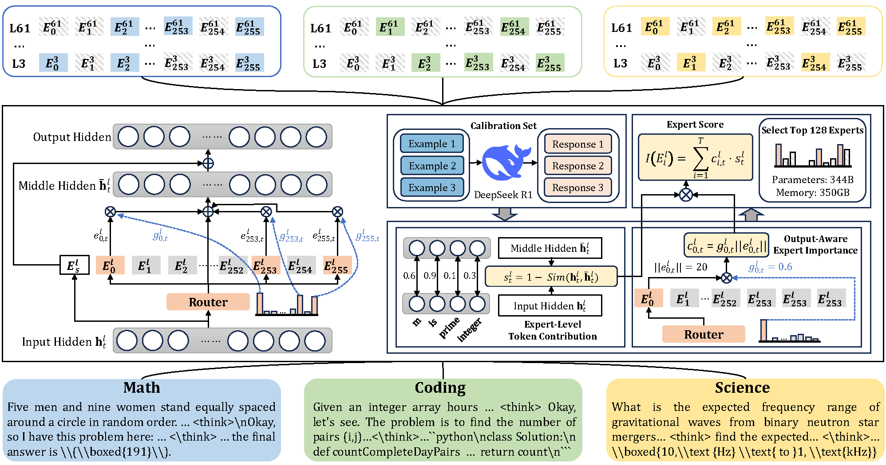

# Table of Contents
- [Table of Contents](#table-of-contents)
  - [1. Introduction](#1-introduction)
  - [2. Preparation](#2-preparation)
    - [2.1 Requirements](#21-requirements)
    - [2.2 Model Preparation](#22-model-preparation)
      - [System Requirements](#system-requirements)
      - [Model Weights Conversion](#model-weights-conversion)
    - [Data Preparation](#data-preparation)
  - [3. Expert Selection](#3-expert-selection)
  - [4. Model Pruning](#4-model-pruning)
    - [4.1 Quick Start](#41-quick-start)
    - [4.2 Actual Pruning](#42-actual-pruning)
      - [Prune the Model](#prune-the-model)
      - [Deploy the Pruned Model](#deploy-the-pruned-model)
  - [5. Evaluation](#5-evaluation)
  - [6. Citation](#6-citation)


## 1. Introduction
Mixture-of-Experts (MoE) models achieve a favorable trade-off between performance and inference efficiency by activating only a subset of experts. However, the memory overhead of storing all experts remains a major limitation, especially in large-scale MoE models such as DeepSeek-R1 (671B). In this study, we investigate domain specialization and expert redundancy in large-scale MoE models and uncover a consistent behavior we term *few-shot expert localization*, with only a few demonstrations, the model consistently activates a sparse and stable subset of experts. Building on this observation, we propose a simple yet effective pruning framework, **EASY-EP**, that leverages a few domain-specific demonstrations to identify and retain only the most relevant experts. EASY-EP comprises two key components: **output-aware expert importance assessment** and **expert-level token contribution estimation**. The former evaluates the importance of each expert for the current token by considering the gating scores and magnitudes of the outputs of activated experts, while the latter assesses the contribution of tokens based on representation similarities after and before routed experts. Experiments show that our method can achieve comparable performances and $2.99\times$ throughput under the same memory budget with full DeepSeek-R1 with only half the experts.



## 2. Preparation
---

### 2.1 Requirements
```bash
cd EasyEP
conda create -n easyep python=3.10
conda activate easyep
pip install -r requirements.txt
```
### 2.2 Model Preparation

#### System Requirements
> [!NOTE] 
> Linux with Python 3.10 only. Mac and Windows are not supported.

Dependencies:
```pip-requirements
torch==2.4.1
triton==3.0.0
transformers==4.46.3
safetensors==0.4.5
```

#### Model Weights Conversion
Our code is based on the official inference demo provided by [DeepSeek](https://github.com/deepseek-ai/DeepSeek-V3/tree/main?tab=readme-ov-file#61-inference-with-deepseek-infer-demo-example-only). It requires Model Weights Conversion. Here, using an 8 x H200 141GB node, the conversion method is as follows:

Download the model weights from Hugging Face, and put them into /path/to/DeepSeek-R1 folder. Then convert Hugging Face model weights to a specific format:

```shell
python pruning/convert.py --hf-ckpt-path /path/to/DeepSeek-R1 --save-path /path/to/DeepSeek-R1-Demo --n-experts 256 --model-parallel 8
```

### Data Preparation


## 3. Expert Selection
---

This part primarily involves extracting and calculating internal MoE hidden states using calibration data, which will be used for later pruning.
```bash
torchrun --nproc_per_node=8 pruning/inf_new.py \
    --ckpt-path /path/to/DeepSeek-R1-Demo \
    --config configs/config_671B.json \
    --input-file dataset/aime23_full \
    --output expert_statistics/token_information/aime.jsonl
```

The expert mask matrix is then derived using statistical information. 
```bash
python pruning/expert_selection.py \
    --input_file expert_statistics/token_information/aime.jsonl \
    --output_file expert_statistics/expert_information/aime23.pt \
    --expert_mask expert_statistics/expert_mask/aime23_128_mask.json \
    --target_number 128
```


## 4. Model Pruning
---

We provide two modes of model pruning using the [sglang](https://github.com/InternLM/sglang) inference framework:

- **Quick evaluation**: Applies gating masks without changing model weights. The full model is loaded, but only selected experts are activated at inference.
- **Actual pruning**: Removes unused expert weights based on the gating mask, reducing the model size.

### 4.1 Quick Start

> [!NOTE]  
> This setup requires `sglang==0.4.3`

1. Replace the code in:
```
path-to-your-conda/envs/easyep/lib/python3.10/site-packages/sglang
```
with the contents of:
```
sglang/sglang_full/sglang
```

2. Modify the mask file path in `sglang/srt/models/deepseek_v2.py` at line 68:
```python
current_fp = "EASYEP/expert_statistics/expert_mask/aime23_full_br_128.json"  # Replace with your own mask path
```

3. Launch the sglang inference server:
```bash
GLOO_SOCKET_IFNAME=bond0 NCCL_SOCKET_IFNAME=bond0 \
python3 -m sglang.launch_server \
    --model-path pruned_model \
    --tp 8 --dist-init-addr localhost:5002 \
    --trust-remote-code \
    --mem-fraction-static 0.9 \
    --host 0.0.0.0 --port 60000 \
    --context-length 32768 \
    --max-prefill-token 32500 \
    --disable-cuda-graph 
```

> ⚠️ In this mode, all 256 routed experts are still loaded for compatibility. The masking is applied during the gating stage. See 3.2 for full pruning.

---

### 4.2 Actual Pruning

#### Prune the Model

Run the pruning script with your custom expert mask to remove unused expert weights (using the original HuggingFace version of DeepSeek-R1):

```bash
python pruning/model_prune.py \
    --mask_json expert_statistics/expert_mask/aime23_full_br_128.json \
    --input_dir path/to/DeepSeek-R1 \
    --output_dir pruned_model
```

Then manually modify `config.json` to match the number of remaining experts:
```json
"n_routed_experts": 128
```

---

#### Deploy the Pruned Model

To evaluate the pruned model using sglang:

1. Replace:
```
path-to-your-conda/envs/easyep/lib/python3.10/site-packages/sglang
```
with:
```
sglang/sglang_pruned/sglang
```

2. If you're using a different version of sglang, make sure to update the following files accordingly:
   - `sglang/srt/models/deepseek_v2.py`
   - `sglang/srt/layers/moe/topk.py`

---

## 5. Evaluation
---

We provide evaluation scripts for math-related tasks. Simply run the script below:

```bash
bash evaluation/scripts/run_eval.sh
```

## 6. Citation
---

If you use this work, please consider citing our project. (Add BibTeX if available.)